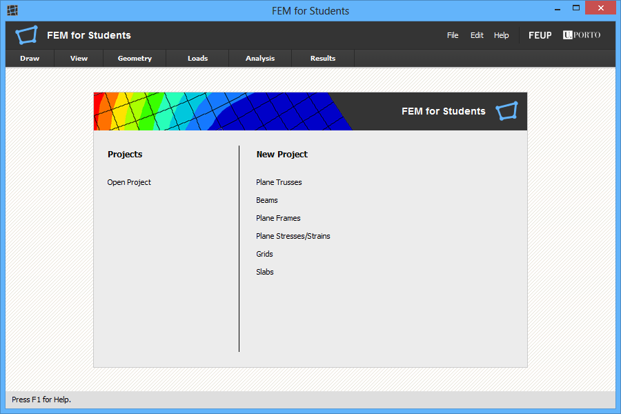
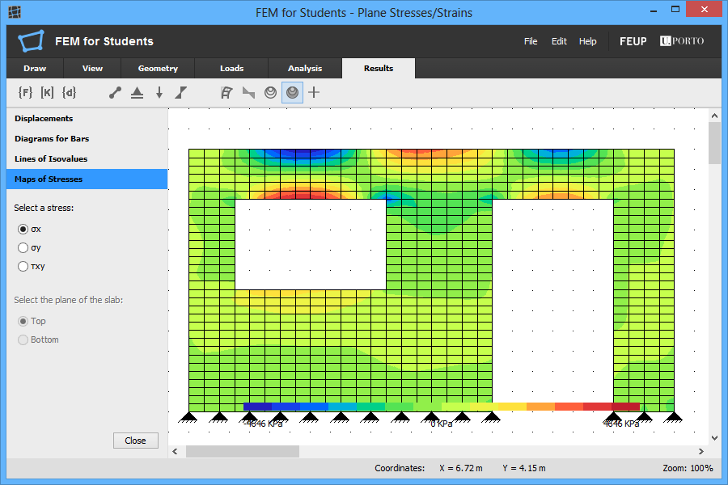

# FEM For Students

**FEM for Students** is a software for modeling and structural analysis by **Finite Element Method**.
This software was developed by me in my master's thesis in Structural Engineering submitted to the [Faculdade de Engenharia da Universidade do Porto](https://sigarra.up.pt/feup/) in October 2014.

## Table of Contents

- [Master's Thesis](#masters-thesis)
- [About FEM for Students](#about-fem-for-students)
- [Requirements](#requirements)
- [Available Gradle Tasks](#available-gradle-tasks)
- [Linting Code](#linting-code)
- [Running Unit Tests](#running-unit-tests)
- [Debugging](#debugging)
- [Build and Release](#build-and-release)
- [Contributing](#contributing)
- [License](#license)

## Master's Thesis

The importance of numerical simulation justified the development of a software based on Finite Element Method to solve various problems.
The master's thesis "[Desenvolvimento de um programa de elementos finitos versátil](https://repositorio-aberto.up.pt/handle/10216/76702)" describes several theories and formulations currently used in structural analysis.
The application is presented and explained with code snippets in order to demonstrate your operation mode.

## About FEM for Students

### Features

It allows modeling simple problems with various finite element formulations.
Models of discrete systems available allow the study of *articulated structures*, *frame structures*, *beams* and *grids*.
For solid bodies, the user can choose between a *plane stress/strain* and *slabs*.
3D modeling is partial implemented. It is missing the graphical user interface.

After initialization, the program displays a panel that allows the user to choose the type of structural model that want for your project.
This panel appears at the center of the program window lets you choose the type of structural model or open a project created earlier.



The different formulations and types of finite elements available are focused on one-dimensional, two-dimensional, three-dimensional finite elements, beams and slabs.
Beam elements are formulated by *Euler-Bernoulli* theory and *Timoshenko* theory.
The finite elements of slab presented are formulated by *Kirchhoff* theory and *Reissner-Mindlin* theory.

To make the program simple, such tools are arranged in a set of tabs sequentially arranged by the steps of modeling, structural analysis and display of results.

### Tabs

The tools and features of the program are organized into the following six tabs:

- **Draw** tab contains the tools needed to design the different finite elements available in the program. Has a few productivity features, including selection of the finite elements, move, cut, copy and paste.
- **View** tab contains visualization tools, in particular, offers the possibility to move the panel, zoom and display a mesh points and other features that facilitate the design of finite elements.
- **Geometry** tab contains the functionality to setting the number of nodes of the finite elements, the remaining properties of sections of finite elements, material properties, refinement of finite element meshes and placing of structural supports.
- **Loads** tab contains tools for assignment of loads to the structural model built. Depending on the structural model can add loads as concentrated loads, bending moments, linear distributed loads, axial loads distributed, surface loads, thermal loads and/or consider the self-weight of the finite elements.
- **Analysis** tab provides, for example, for the finite element beam and slab selection of theory formulation. Enables even choose the analysis will be analytical or numerical and the button to perform the calculation of the structure.
- **Results** tab, depending on the selected model, it is possible to see, for example, the global system equations, all results the level of each finite element, the deformed shape of the structure, diagrams for bars, maps of stresses and/or stresses and principal directions.

### Graphical Results

In the *Results* tab are available the options to choose the type of results obtained by finite element analysis.

In the first group of buttons, options for the visualization of the global system of equations are available.
In the second group the options for viewing the results in tables at the level of finite elements are available.
Thus, besides the global system of equations, you can see the balance equation for each finite element, the support reactions, nodal forces and nodal stresses.
In the latter group are concentrated features for graphical representation of results.

For all models it is possible to visualize the deformed structure.
In addition, for models of bars you can view diagrams of forces and for two-dimensional models the isovalue lines, maps of stresses and stresses and principal directions.
Regarding the display of isovalue lines and maps of stresses, the user can choose that stress want to see represented.



### Other features

Other features of the program are concentrated in the *File*, *Edit* and *Help* menus.
So that users can store the created projects and later retrieve them, the program allows them to save their work.

FEM for Students also presents, for example, information relating to the positioning of the mouse and tips on the operation of the selected tools.
These tips are always presented to the user selects particular tool and are intended to inform you about the operating mode of this.
These elements are arranged in the lower pane of the user interface.

FEM for Students allows modeling simple problems with various finite element formulations.
Models of discrete systems available allow the study of articulated structures, frame structures, beams and grids.
For solid bodies, the user can choose between a plane stress or strain and the study of slabs by the two theories available.

## Requirements

FEM for Students was written in `Java` programming language.
In order to run the program on your computer you must have `Java JDK` installed.

[Apache Netbeans](https://netbeans.apache.org/) is the recommended IDE but you can use another IDE such as [Visual Studio Code](https://code.visualstudio.com/).
However, if you want to edit the *user interface*, Apache Netbeans is required.
To support code contributions, the original project was adapted for a [Gradle](https://gradle.org/) project.
UFT-8 is required because the source code contains Greek and Latin characters.

## Available Gradle Tasks

The tasks in [build.gradle](build.gradle) file were built with simplicity in mind to automate as much repetitive tasks as possible and help developers focus on what really matters.

The next tasks should be executed in a console inside the root directory:

- `./gradlew tasks` - Displays the tasks runnable from root project 'app'.
- `./gradlew run` - Runs this project as a JVM application
- `./gradlew check` - Runs all checks.
- `./gradlew test` - Runs the unit tests.
- `./gradlew checkstyle` - Runs several static code analysis.
- `./gradlew clean` - Deletes the build directory.
- `./gradlew javadoc` - Generates Javadoc API documentation for the main source code.
- `./gradlew build` - Assembles and tests this project.
- `./gradlew jar` - Assembles a jar archive containing the main classes.
- `./gradlew help` - Displays a help message.

For more details, read the [Command-Line Interface](https://docs.gradle.org/current/userguide/command_line_interface.html) documentation in the [Gradle User Manual](https://docs.gradle.org/current/userguide/userguide.html).

## Development Mode

This program was developed with [Apache Netbeans](https://netbeans.apache.org/) in 2014.
You can use any IDE, but if you want to edit the user interface, Apache Netbeans is required.

The original project was adapted for a [Gradle](https://gradle.org/) project, but you don't need to install Gradle on your machine.
This project uses [Gradle Wrapper](https://docs.gradle.org/current/userguide/gradle_wrapper.html) instead of the global install.

After cloning the project, use `./gradlew run` to fetch its dependencies and start the application.
Alternatively, you can use the `start` button of your favorite IDE.

## Linting Code

A linter is a static code analysis tool used to flag programming errors, bugs, stylistic errors and suspicious constructs.

Use `./gradlew checkstyle` to analyze the code with [Checkstyle](https://checkstyle.sourceforge.io/).
Checkstyle finds class design problems, method design problems, and others. It also has the ability to check code layout and formatting issues.

## Running Unit Tests

Use `./gradlew test` to execute the unit tests via [JUnit 5](https://junit.org/junit5/).
Use `./gradlew test -t` to keep executing unit tests in real time while watching for file changes in the background.
You can see the HTML report opening the [index.html](build/reports/tests/test/index.html) file in your web browser.

It's a common requirement to run subsets of a test suite, such as when you're fixing a bug or developing a new test case.
Gradle provides different mechanisms.
For example, the following command lines run either all or exactly one of the tests in the `SomeTestClass` test case:

```bash
./gradlew test --tests SomeTestClass
```

For more details, you can see the [Test filtering](https://docs.gradle.org/current/userguide/java_testing.html#test_filtering) section of the Gradle documentation.

## Debugging

You can debug the source code, add breakpoints, inspect variables and view the application's call stack with your favorite IDE

You can customize the [log verbosity](https://docs.gradle.org/current/userguide/logging.html#logging) of gradle tasks using the `-i` or `--info` flag.

## Build and Release

Use `./gradlew build` to assemble and test this project. Note that this tasks runs several checks, including Checkstyle and unit tests.

Alternatively,  you can use `./gradlew jar` to create the JAR file. This artifact is stored in the `build/libs` directory.

Use `./gradlew javadoc` to generate the Javadoc documentation for this project.

## Contributing

Pull requests are welcome.
Please read the [contribution guidelines](CONTRIBUTING.md).

For major changes, open an issue first to discuss what you would like to change.

## License

FEM for Students is [MIT licensed](LICENSE).
